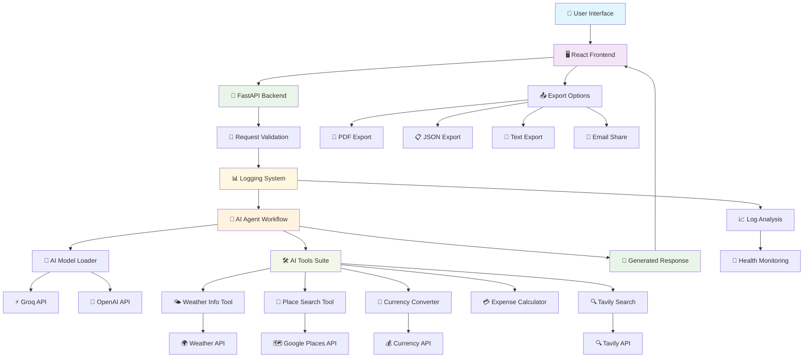

# 🌍 AI Travel Planner

A comprehensive AI-powered travel planning application built with FastAPI backend and React frontend. This application leverages advanced AI models to create personalized travel itineraries with real-time information about weather, places, currency conversion, and expense calculations.

## ✨ Features

### 🤖 AI-Powered Planning
- **Advanced AI Models**: Uses Groq and OpenAI models for intelligent travel planning
- **Multi-Tool Integration**: Weather forecasting, place search, currency conversion, and expense calculation
- **Personalized Itineraries**: Tailored travel plans based on user preferences and requirements
- **Real-time Information**: Live weather data and current place information

### 🖥️ Modern Frontend
- **React + TypeScript**: Modern, type-safe frontend with excellent UX
- **Responsive Design**: Works perfectly on desktop, tablet, and mobile devices
- **Real-time Connectivity**: Connection status monitoring and automatic reconnection
- **Advanced Features**: Save plans, share functionality, copy to clipboard
- **Beautiful UI**: Travel-themed design with smooth animations and intuitive interface

### 🔧 Robust Backend
- **FastAPI**: High-performance, async API server
- **Comprehensive Logging**: Structured logging with analysis tools
- **Error Handling**: Graceful error handling with detailed feedback
- **Health Monitoring**: Built-in health checks and monitoring endpoints
- **Production Ready**: Optimized for production deployment

## � System Architecture & Workflow

The AI Travel Planner follows a comprehensive workflow that integrates multiple AI tools and external APIs to create personalized travel experiences:



### 🔍 Detailed Workflow Steps

#### 1. **User Interaction Layer**
```
👤 User → 🖥️ Frontend → 🎯 Query Input → 🔄 Real-time Status
```

#### 2. **API Processing Pipeline**
```
🚀 FastAPI → 🔐 Validation → 📊 Logging → 🤖 AI Agent
```

#### 3. **AI Model Selection**
```
🧠 Model Loader → {
    ⚡ Groq (Primary): Llama-3.1-70b-versatile
    🤖 OpenAI (Backup): GPT-3.5-turbo/GPT-4
}
```

#### 4. **Tool Integration Workflow**
```
🛠️ AI Tools Suite → {
    🌤️ Weather Tool    → 🌍 Weather API
    📍 Place Search    → 🗺️ Google Places API
    💱 Currency Tool   → 💰 Currency Exchange API
    💳 Expense Tool    → 🧮 Cost Calculations
    🔍 Search Tool     → 🔍 Tavily Search API
}
```

#### 5. **Response Generation**
```
📝 AI Response → 🎨 Markdown Formatting → 📤 Export Options
```

#### 6. **Export & Share Pipeline**
```
📤 Export → {
    📄 PDF (Styled)
    📋 JSON (Structured)
    📄 TXT (Plain)
    📧 Email (Share)
}
```

#### 7. **Monitoring & Analytics**
```
📊 Logging → {
    📈 Performance Metrics
    🏥 Health Monitoring
    🔍 Query Analysis
    ⚠️ Error Tracking
}
```

### 🎯 Key Features Flow

#### **Travel Planning Process**
1. **User Query** → Natural language travel request
2. **AI Analysis** → Understanding context, preferences, and constraints
3. **Tool Orchestration** → Weather, places, currency, and expense data
4. **Content Generation** → Structured travel itinerary
5. **Response Delivery** → Formatted, exportable travel plan

#### **Real-time Data Integration**
- **Weather**: Live weather forecasts for destinations
- **Places**: Current place information and ratings
- **Currency**: Real-time exchange rates
- **Expenses**: Dynamic cost calculations

#### **Export & Sharing**
- **PDF**: Professional, print-ready documents
- **JSON**: Structured data for further processing
- **Text**: Simple, readable format
- **Email**: Direct sharing capabilities

### 🔧 Technical Architecture

#### **Frontend (React + TypeScript)**
```
🖥️ React Components → 🎨 Tailwind CSS → 📱 Responsive Design
```

#### **Backend (FastAPI + Python)**
```
🚀 FastAPI → 🔄 Async Processing → 📊 Structured Logging
```

#### **AI Integration (LangChain)**
```
🤖 LangChain → 🛠️ Custom Tools → 🧠 Model Abstraction
```

#### **Data Flow**
```
📥 Input → 🔄 Processing → 🛠️ Tools → 🤖 AI → 📤 Output
```

## �🚀 Quick Start

### Prerequisites
- Python 3.10 or higher
- Node.js 18 or higher (for frontend)
- API Keys for:
  - Groq API
  - OpenAI API (optional)
  - Weather API
  - Google Places API
  - Tavily Search API

### 1. Clone the Repository
```bash
git clone https://github.com/aveera04/AI_Trip_Planner.git
cd AI_Trip_Planner
```

### 2. Backend Setup

#### Create Virtual Environment
```bash
python -m venv .venv
```

#### Activate Virtual Environment
**Windows:**
```bash
.venv\Scripts\activate
```

**Linux/Mac:**
```bash
source .venv/bin/activate
```

#### Install Dependencies
```bash
pip install -r requirements.txt
```

#### Configure Environment Variables
Create a `.env` file in the root directory:
```env
# AI Model Configuration
GROQ_API_KEY=your_groq_api_key_here
OPENAI_API_KEY=your_openai_api_key_here

# External APIs
WEATHER_API_KEY=your_weather_api_key_here
GOOGLE_PLACES_API_KEY=your_google_places_api_key_here
TAVILY_API_KEY=your_tavily_api_key_here

# Application Settings
GENERATE_GRAPH_VISUALIZATION=false
FRONTEND_URL=http://localhost:8081

# Optional: Currency API
ALPHAVANTAGE_API_KEY=your_alphavantage_api_key_here
```

### 3. Frontend Setup

#### Navigate to Frontend Directory
```bash
cd frontend
```

#### Install Dependencies
```bash
npm install
```

#### Configure Environment
Create a `.env` file in the frontend directory:
```env
VITE_API_BASE_URL=http://localhost:8000
```

### 4. Run the Application

#### Start Backend Server (Terminal 1)
```bash
# In root directory with activated virtual environment
python -m uvicorn main:app --reload --port 8000
```

#### Start Frontend Server (Terminal 2)
```bash
# In frontend directory
npm run dev
```

### 5. Access the Application
- **Frontend**: http://localhost:8081
- **Backend API**: http://localhost:8000
- **API Documentation**: http://localhost:8000/docs

## 📁 Project Structure

```
AI_Trip_Planner/
├── 📁 agent/                    # AI Agent and Workflow
│   ├── __init__.py
│   └── agentic_workflow.py      # Main AI workflow logic
├── 📁 config/                   # Configuration files
│   ├── __init__.py
│   └── config.yaml
├── 📁 exception/                # Custom exceptions
│   ├── __init__.py
│   └── exceptiohandling.py
├── 📁 frontend/                 # React frontend application
│   ├── 📁 src/
│   │   ├── 📁 components/       # React components
│   │   ├── 📁 pages/           # Page components
│   │   ├── 📁 services/        # API services
│   │   ├── 📁 types/           # TypeScript types
│   │   └── 📁 hooks/           # Custom React hooks
│   ├── package.json
│   └── vite.config.ts
├── 📁 logger/                   # Logging system
│   ├── __init__.py
│   ├── logger_config.py         # Logger configuration
│   ├── analysis.py              # Log analysis tools
│   ├── utils.py                 # Logging utilities
│   └── 📁 logs/                # Log files
├── 📁 notebook/                 # Jupyter notebooks for experiments
│   └── experiments.ipynb
├── 📁 prompt_library/           # AI prompts
│   ├── __init__.py
│   └── prompt.py
├── 📁 tools/                    # AI tools and utilities
│   ├── __init__.py
│   ├── currency_conversion_tool.py
│   ├── expense_calculator_tool.py
│   ├── place_search_tool.py
│   └── weather_info_tool.py
├── 📁 utils/                    # Utility functions
│   ├── __init__.py
│   ├── config_loader.py
│   ├── currency_converter.py
│   ├── expense_calculator.py
│   ├── model_loader.py
│   ├── place_info_search.py
│   └── weather_info.py
├── main.py                      # Main FastAPI application
├── requirements.txt             # Python dependencies
├── pyproject.toml              # Project metadata
├── setup.py                    # Package setup
├── log_viewer.py               # Log viewing utility
├── start_server.ps1            # PowerShell start script
└── README.md                   # This file
```

## 🔧 API Endpoints

### Health Check
```http
GET /health
```
Returns server health status and system information.

### API Information
```http
GET /api/info
```
Returns API metadata and available endpoints.

### Travel Planning
```http
POST /query
Content-Type: application/json

{
  "question": "Plan a 5-day trip to Paris with a budget of $2000"
}
```

Returns a comprehensive travel plan with:
- Daily itinerary
- Weather information
- Cost estimates
- Place recommendations
- Transportation suggestions

## 🛠️ Configuration

### Environment Variables

#### Backend Configuration
- `GROQ_API_KEY`: Your Groq API key (required)
- `OPENAI_API_KEY`: Your OpenAI API key (optional)
- `WEATHER_API_KEY`: Weather service API key
- `GOOGLE_PLACES_API_KEY`: Google Places API key
- `TAVILY_API_KEY`: Tavily search API key
- `GENERATE_GRAPH_VISUALIZATION`: Enable/disable graph visualization (default: false)
- `FRONTEND_URL`: Frontend URL for CORS (default: http://localhost:8081)

#### Frontend Configuration
- `VITE_API_BASE_URL`: Backend API URL (default: http://localhost:8000)

### Model Configuration
The application supports multiple AI models:
- **Groq**: Fast inference with models like Llama-3.1-70b-versatile
- **OpenAI**: GPT-3.5-turbo and GPT-4 models

Configure the model in `config/config.yaml`:
```yaml
model:
  provider: "groq"  # or "openai"
  model_name: "llama-3.1-70b-versatile"
  temperature: 0.7
  max_tokens: 4096
```

## 📊 Logging and Monitoring

### Log Files
- `logger/logs/system.log`: General application logs
- `logger/logs/structured.log`: JSON-formatted logs for analysis
- `logger/logs/error.log`: Error logs only
- `logger/logs/queries.log`: Travel query logs
- `logger/logs/access.log`: API access logs

### Log Viewer
Use the built-in log viewer to analyze system performance:

```bash
# View system health
python log_viewer.py --health

# View recent logs
python log_viewer.py --logs system --hours 24

# View query analysis
python log_viewer.py --queries --hours 24

# View error analysis
python log_viewer.py --errors --hours 24

# View everything
python log_viewer.py --all
```

## 🧪 Development

### Running Tests
```bash
# Backend tests
pytest

# Frontend tests
cd frontend
npm test
```

### Development Mode
For development, you can enable additional features:
```env
GENERATE_GRAPH_VISUALIZATION=true
LOG_LEVEL=DEBUG
```

### Code Quality
The project uses:
- **TypeScript**: Type safety for frontend
- **ESLint**: Code linting for JavaScript/TypeScript
- **Prettier**: Code formatting
- **Black**: Python code formatting

## 🚢 Production Deployment

### Backend Deployment
```bash
# Using Gunicorn for production
pip install gunicorn
gunicorn main:app -w 4 -k uvicorn.workers.UvicornWorker --bind 0.0.0.0:8000
```

### Frontend Deployment
```bash
cd frontend
npm run build
# Deploy the dist/ folder to your static hosting service
```

### Docker Deployment
```dockerfile
# Dockerfile example
FROM python:3.11-slim

WORKDIR /app
COPY requirements.txt .
RUN pip install -r requirements.txt

COPY . .
EXPOSE 8000

CMD ["uvicorn", "main:app", "--host", "0.0.0.0", "--port", "8000"]
```

### Environment Variables for Production
```env
# Production settings
CORS_ORIGINS=https://yourdomain.com
GENERATE_GRAPH_VISUALIZATION=false
LOG_LEVEL=INFO
```

## 🔒 Security

### API Keys
- Store all API keys in environment variables
- Never commit API keys to version control
- Use different API keys for development and production
- Rotate API keys regularly

### CORS Configuration
For production, configure specific origins:
```python
allow_origins=["https://yourdomain.com", "https://www.yourdomain.com"]
```

### Rate Limiting
Consider implementing rate limiting for production:
```python
from slowapi import Limiter
from slowapi.util import get_remote_address

limiter = Limiter(key_func=get_remote_address)
```

## 🤝 Contributing

### Getting Started
1. Fork the repository
2. Create a feature branch: `git checkout -b feature/amazing-feature`
3. Make your changes
4. Run tests: `pytest` and `npm test`
5. Commit changes: `git commit -m 'Add amazing feature'`
6. Push to branch: `git push origin feature/amazing-feature`
7. Open a Pull Request

### Code Style
- Follow PEP 8 for Python code
- Use TypeScript for all frontend code
- Write comprehensive tests for new features
- Update documentation for API changes

### Reporting Issues
Please use the GitHub issue tracker to report bugs or request features.

## 📄 License

This project is licensed under the MIT License - see the [LICENSE](LICENSE) file for details.

## 🙏 Acknowledgments

- **LangChain**: For the AI framework
- **FastAPI**: For the high-performance API framework
- **React**: For the frontend framework
- **Groq**: For fast AI model inference
- **OpenAI**: For advanced AI models
- **All Contributors**: Thanks to everyone who has contributed to this project

## 📞 Support

For support, please:
1. Check the [documentation](README.md)
2. Search [existing issues](https://github.com/aveera04/AI_Trip_Planner/issues)
3. Create a [new issue](https://github.com/aveera04/AI_Trip_Planner/issues/new)

---

**Happy traveling! 🌍✈️**